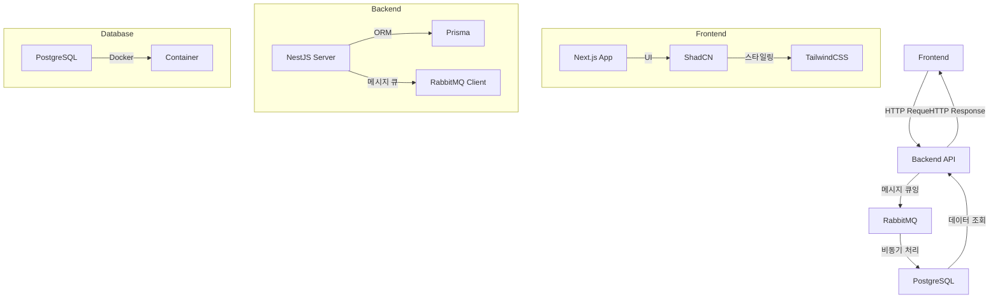
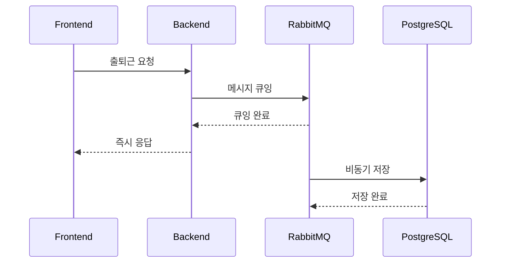
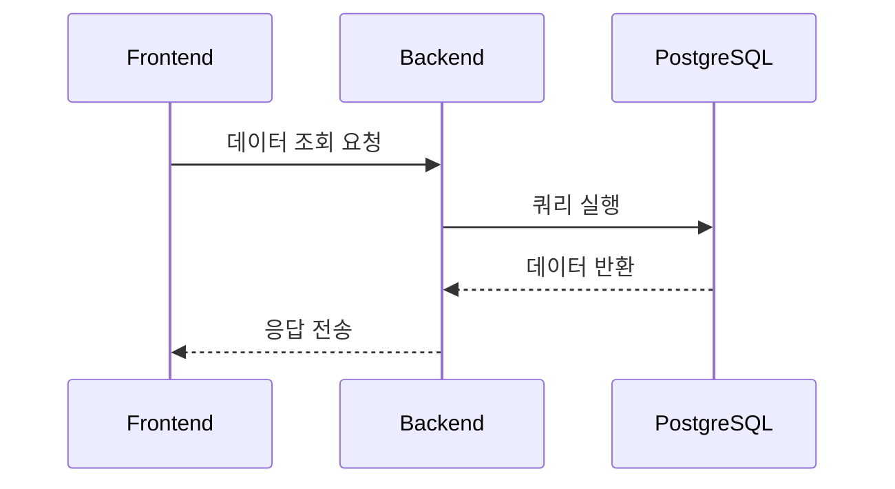

# 출근/퇴근 기록 및 관리자 출석 관리 시스템

## 프로젝트 개요
기업용 출근/퇴근 기록 및 관리자 출석 관리 시스템입니다. 일반 사용자는 웹에서 출근/퇴근 버튼을 눌러 자신의 출퇴근 기록을 남기고, 관리자는 전체 출석 데이터를 조회 및 엑셀로 다운로드할 수 있습니다.

## 주요 사용자 및 역할
- **일반 사용자**: 본인 출근/퇴근 기록 입력 및 조회
- **관리자**: 전체 출석 데이터 조회, 엑셀 다운로드

## 주요 기능
### 일반 사용자
- 출근 버튼 클릭 → 출근 시간 기록
- 퇴근 버튼 클릭 → 퇴근 시간 기록
- 본인 출퇴근 내역 조회

### 관리자
- 전체 출석 데이터 조회(날짜별, 사용자별 등)
- 엑셀 다운로드

## 실제 개발 및 연동 절차 (실행/테스트 경험 기반)

### 1. 개발 환경 준비 및 실행
- **백엔드(NestJS)**: 4000번 포트에서 실행
  ```bash
  cd backend_nestjs
  npm install
  npm run start:dev
  ```
- **프론트엔드(Next.js)**: 3000번 포트에서 실행
  ```bash
  cd frontend_nextjs
  npm install
  npm run dev
  ```
- **프론트엔드 환경변수 설정**: `frontend_nextjs/.env.local` 파일에 아래 내용 추가
  ```
  NEXT_PUBLIC_API_BASE=http://localhost:4000
  ```
- **DB(PostgreSQL, Docker)**:
  ```bash
  docker run --name daily-check-db -e POSTGRES_PASSWORD=password -e POSTGRES_DB=daily_check -p 5432:5432 -d postgres
  ```

### 2. Prisma 마이그레이션 및 DB 테이블 생성
- `.env` 파일의 DB 연결 정보와 도커 컨테이너 정보가 일치해야 함
- 마이그레이션 적용:
  ```bash
  cd backend_nestjs
  npx prisma migrate dev --name init
  ```
- 테이블 생성 확인:
  ```bash
  docker exec -it daily-check-db psql -U postgres -d daily_check
  \dt
  ```

### 3. 예시 데이터 삽입 및 확인
- 회사, 사용자, 출근/퇴근 기록 예시 데이터 삽입:
  ```sql
  INSERT INTO "Company" (name, "createdAt", "updatedAt") VALUES ('AI회사', NOW(), NOW());
  INSERT INTO "User" (name, "companyId", "createdAt", "updatedAt") VALUES ('홍길동', 1, NOW(), NOW());
  INSERT INTO "Record" ("userId", "checkIn", "createdAt", "updatedAt") VALUES (1, NOW(), NOW(), NOW());
  UPDATE "Record" SET "checkOut" = NOW() WHERE id = 1; -- 퇴근 기록 예시
  SELECT * FROM "Record";
  ```
- 실제로 프론트엔드에서 출근/퇴근 버튼을 누르면, 해당 정보가 DB에 반영되는지 위 쿼리로 확인

### 4. 프론트엔드-백엔드 연동 및 CORS 문제 해결
- 프론트엔드에서 API 요청 시 CORS 에러 발생 시, `backend_nestjs/src/main.ts`에 아래 코드 추가:
  ```typescript
  app.enableCors();
  ```
- 프론트엔드에서 출근/퇴근 시도 시, 백엔드 터미널에 POST/GET 로그가 찍히는지 확인
- 브라우저 개발자도구 네트워크 탭에서 실제 요청이 4000번 포트로 가는지 확인

### 5. 정상 동작 확인
- 출근/퇴근 버튼 클릭 시, "출근이 기록되었습니다!", "퇴근이 기록되었습니다!" 등 메시지 확인
- 이미 출근 기록이 있으면 "이미 출근 기록이 있습니다." 메시지 확인
- DB에서 checkIn, checkOut 값이 정상적으로 저장되는지 확인

## 데이터 흐름
1. 일반 사용자가 웹에서 출근/퇴근 버튼 클릭
2. 프론트엔드 → 백엔드 → DB에 출근/퇴근 시간 저장
3. 관리자는 웹에서 출석 데이터 조회/다운로드
4. 프론트엔드 → 백엔드 → DB에서 데이터 조회 및 엑셀 변환

## 기술 스택
- Frontend: Next.js (App Router) + ShadCN + TailwindCSS
- Backend: NestJS + Prisma
- Database: PostgreSQL (Docker 컨테이너로 실행, 포트 5432)
- 배포: 프론트는 Vercel, 백엔드는 Render 사용 예정
- 인증: 초기에는 인증 없이 출석만 기록, 이후 JWT 기반 관리자 인증 도입 예정

## 데이터 흐름도



## 주요 기능별 데이터 흐름

### 1. 출퇴근 기록


### 2. 데이터 조회


## 안정성 보장 메커니즘

### 1. 메시지 큐 시스템
- 출퇴근 데이터는 즉시 DB에 저장하지 않고 RabbitMQ에 먼저 저장
- 메시지는 영구적으로 저장되어 서버 재시작 후에도 유지
- DB 서버 장애 시에도 데이터 유실 없음

### 2. 비동기 처리
- 출퇴근 요청은 즉시 메시지 큐에 저장 후 응답
- 실제 DB 저장은 백그라운드에서 비동기적으로 처리
- 사용자는 DB 상태와 관계없이 빠른 응답 수신

### 3. 재시도 메커니즘
- DB 저장 실패 시 자동으로 재시도
- 실패한 메시지는 다시 큐에 넣어서 처리
- 최대한 데이터 유실 방지

### 4. 장애 복구
- DB 서버 복구 후 자동으로 대기 중인 데이터 처리
- 메시지 큐의 영구 저장으로 복구 시점의 데이터 보존
- 수동 개입 없이 자동 복구 가능

## API 엔드포인트

### 출퇴근 관련
- POST `/attendance/check-in`: 출근 기록
- POST `/attendance/check-out`: 퇴근 기록
- GET `/attendance/my-records`: 개인 출퇴근 기록 조회
- GET `/attendance/admin/records`: 관리자용 전체 출퇴근 기록 조회

### 관리자 기능
- GET `/admin/export`: 엑셀 다운로드
- GET `/admin/old-records`: 오래된 데이터 조회
- POST `/admin/backup`: 수동 백업 생성
- DELETE `/admin/old-records`: 오래된 데이터 삭제

## 개발 환경 설정

### 프론트엔드 (Next.js)
```bash
cd frontend_nextjs
npm install
npm run dev
```

### 백엔드 (NestJS)
```bash
cd backend_nestjs
npm install
npm run start:dev
```

### 데이터베이스 (PostgreSQL)
```bash
docker run --name postgres -e POSTGRES_PASSWORD=password -p 5432:5432 -d postgres
```

## 배포 계획
1. 개발 초기에는 로컬 환경에서 테스트
2. 프론트엔드는 Vercel에 배포
3. 백엔드는 Render에 배포
4. 데이터베이스는 Supabase 또는 Render Postgres로 전환 예정

## 미정/논의 필요 사항
- 사용자 인증 방식 (예: 이메일, 사번, 사내 계정 등)
- 관리자 권한 부여 기준
- 출근/퇴근 시간 수정 정책
- 데이터 보관 기간 및 보안 정책
- 알림/푸시 기능 여부

## Record 테이블 컬럼 설명

| 컬럼명    | 설명                                                                 |
|-----------|---------------------------------------------------------------------|
| id        | 출퇴근 기록의 고유 식별자(Primary Key). 각 기록마다 자동으로 증가하는 번호입니다. |
| userId    | 출퇴근 기록을 남긴 사용자의 고유 ID. User 테이블의 id와 연결(외래키)됩니다. |
| checkIn   | 출근 시간. 사용자가 출근 버튼을 눌렀을 때 기록되는 날짜와 시간입니다. |
| checkOut  | 퇴근 시간. 사용자가 퇴근 버튼을 눌렀을 때 기록되는 날짜와 시간입니다. |
| createdAt | 이 출퇴근 기록이 처음 생성된 날짜와 시간입니다. (출근 기록 생성 시 자동 입력) |
| updatedAt | 이 출퇴근 기록이 마지막으로 수정된 날짜와 시간입니다. (퇴근 시 자동 갱신) | 